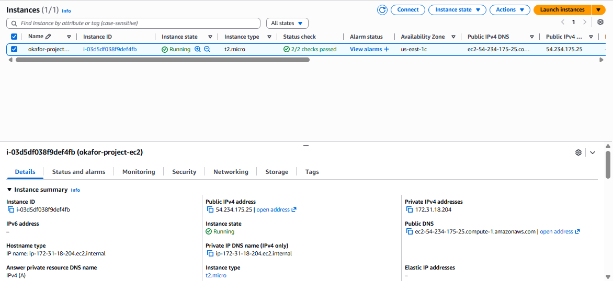
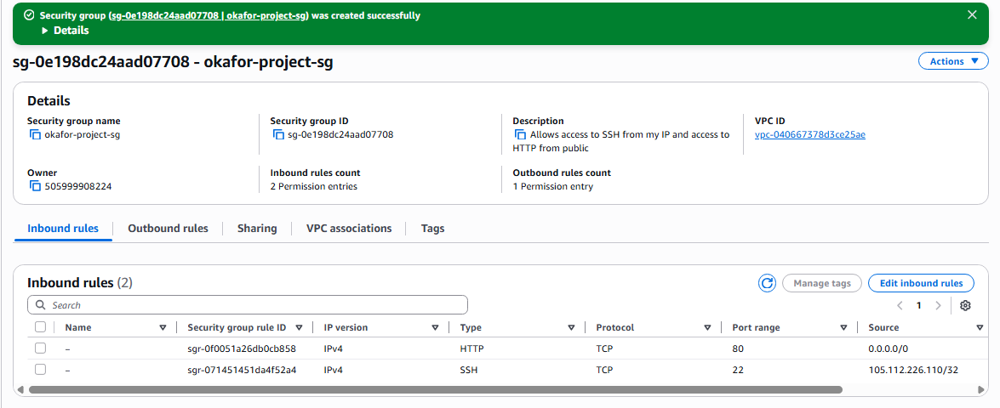
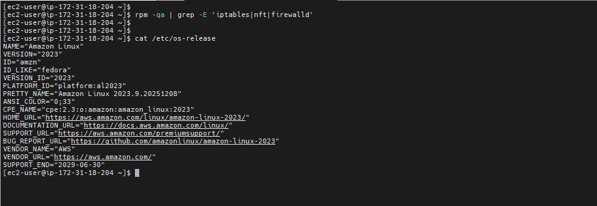
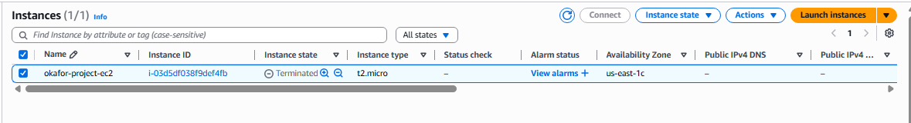

# secure-ec2-nginx

Deployed and secured an AWS EC2 web server running NGINX with cost controls and clearly documented security decisions.

## Project Overview

This project documents the deployment of a secure web server on AWS using an EC2 instance running NGINX.
The goal was to simulate a real-world cloud deployment, apply baseline security controls, and manage AWS costs responsibly in a production-like environment.

The focus was not just on getting a server running, but on understanding how AWS enforces security, how Linux behaves by default, and how small configuration decisions impact risk and cost.

## Tech Stack

* AWS EC2
* Amazon Linux 2023
* NGINX
* AWS Security Groups
* Linux CLI

## Architecture

The architecture for this project is intentionally minimal to emphasize clarity and security boundaries:

User
→ Internet
→ AWS Security Group
→ EC2 Instance (Amazon Linux 2023)
→ NGINX Web Server

Traffic is filtered at the AWS Security Group level before it reaches the EC2 instance.

## Security Measures

The following security measures were implemented:

* SSH access (port 22) restricted to my IP address only
* HTTP access (port 80) allowed publicly to serve web content
* Key-based SSH authentication used instead of passwords
* AWS Security Groups used as the primary network firewall
* OS-level firewall tools are not enabled by default on Amazon Linux 2023, so traffic control was enforced at the AWS level

An insecure configuration where SSH was opened publicly was briefly tested and immediately corrected to understand the associated risk.

Security controls were intentionally applied at the cloud network layer to reduce attack surface before traffic reached the instance.

## Issues Faced and Lessons Learned

During the project, several issues were encountered:

* Initial SSH connection confusion due to key pair handling
* Discovering that firewalld, iptables, and nftables are not installed by default on Amazon Linux 2023
* Understanding the functional difference between OS-level firewalls and AWS Security Groups

These challenges helped clarify how AWS enforces security at the network layer and why cloud-native security controls are often preferred.
This reinforced the importance of understanding default OS behavior when deploying infrastructure in the cloud.

## Cost Management

Cost control was treated as a core requirement throughout the project:

* Instance type: t2.micro (AWS Free Tier eligible)
* Region: us-east-1
* AWS budget alerts configured to notify before exceeding set limits
* EC2 instance stopped and terminated immediately after testing

All resources were cleaned up after use to prevent unintended charges, ensuring hands-on learning without unnecessary cost.

## Next Steps

* Recreate this deployment using Terraform
* Apply IAM hardening and least-privilege policies
* Extend the setup with logging and monitoring
